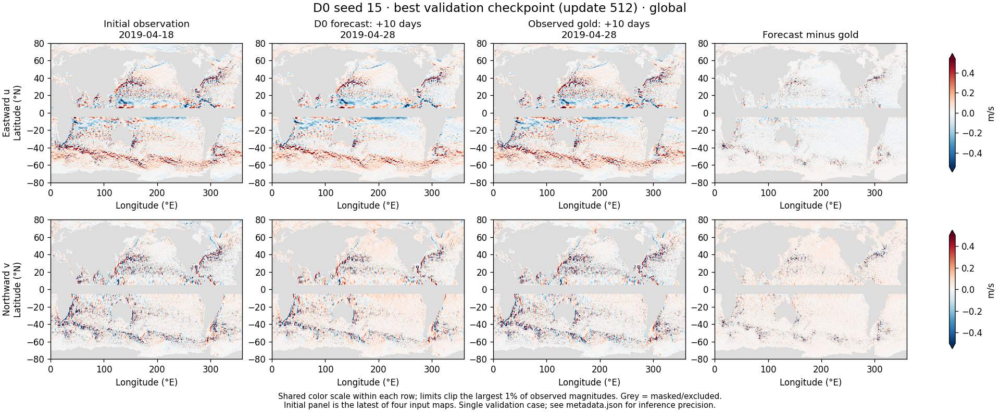
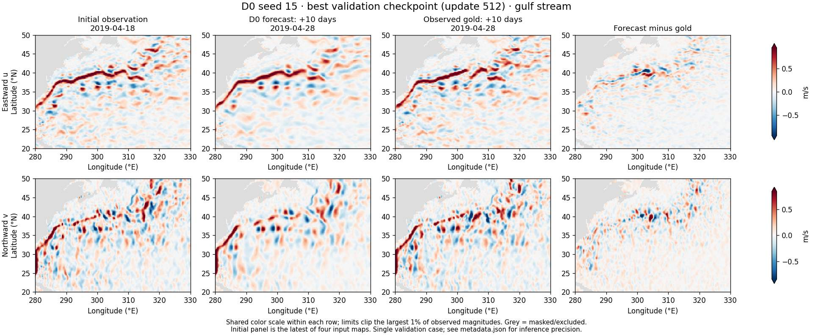

<!--
SPDX-FileCopyrightText: 2026 Samudra Authors

SPDX-License-Identifier: CC-BY-4.0
-->

# D0: one ten-day forecast

The first eligible validation case with an exact ten-day lead: **April 18 to April 28, 2019**. D0 seed 15 uses its selected checkpoint at update 512 from the completed 128 GPU-hour-target confirmation run. Inference ran locally on NVIDIA GB10 with bfloat16 autocast and the original shared Samudra experiment code.

Columns show the initial observation, the recursive ten-day forecast, the observed DUACS target, and forecast minus target. Rows show eastward and northward velocity in m/s, with one shared color scale per row. Grey cells are masked or excluded. The initial panel is the latest input map; the complete history consists of April 3, 8, 13 and 18. Two five-day model steps produce the forecast.

The Gulf Stream forecast retains the main current but smooths smaller structures. For this single case, area-weighted global vector RMSE is **0.10184 m/s**, versus **0.14986 m/s** for persistence, on 624,500 common valid cells. This illustration is not the final multi-date held-out evaluation. DUACS targets are retrospective five-day averaged fields.

[Metadata and checkpoint provenance](metadata.json). The checkpoint checksum matches the previously audited seed-15 confirmation checkpoint. The plotting and inference script is [velocity_quicklook.py](../../../scripts/velocity_quicklook.py); its inputs are the prepared DUACS store and selected `best.pt`. The same case was used for the global view and zoom; neither was selected based on forecast error.
