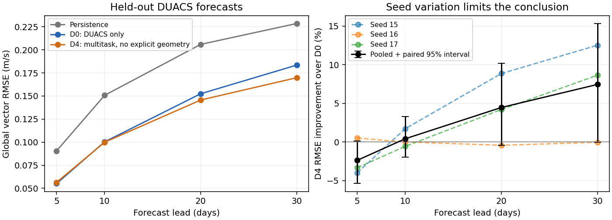

<!--
SPDX-FileCopyrightText: 2026 Samudra Authors
SPDX-License-Identifier: CC-BY-4.0
-->

# Shared original Samudra: DUACS velocity transfer

The selected transfer arm **D4** changed held-out 10-day DUACS vector RMSE by **+0.42% improvement** relative to DUACS-only D0 (paired seed/calendar-quarter bootstrap 95% interval -1.98% to +3.30%). The point estimate does not meet the provisional 3% improvement target.

**This experiment does not establish a reliable 10-day benefit from this multitask recipe.** The 30-day point estimate is more promising (+7.45%), but its interval also includes zero. Five-day RMSE worsens by 2.38%. Seed 16 shows essentially no held-out benefit, while seeds 15 and 17 improve at longer leads. The shared backbone can train across these global/regional inputs, but successful joint optimization is a weaker result than improved observational forecast skill.

Completed September 16, 2026, before Torch maintenance. All six screening runs, six confirmation runs, and twelve full validation/test evaluations completed.

## Method

One original ConvNeXt U-Net shares all backbone weights across sources, with small source-specific input/output adapters. Four five-day velocity histories predict the next map recursively. Local DUACS geostrophic velocities are coarsened from 1/8° to 1/4°; OM4 geostrophic velocities are derived from SSH on the 1° global grid and 1/4° regional crops. No Perceiver or LLC data are used.

DUACS contributes only 280 overlapping training windows: four input maps and two target maps per window, sampled with replacement. The training split contains 289 five-day timesteps (2014-10-20 through 2018-09-30); 285 distinct maps occur in optimization windows. The shared 30-day eligibility rule leaves four additional end-of-split maps unused by the 10-day training objective. Each map covers the global 1/4° grid. The two OM4 resolutions each provide 4,426 eligible windows from the same 1958–2018 trajectory. More updates therefore mostly repeat existing dates, rather than adding independent temporal samples. No external wind-stress or heat-flux forcing is supplied.

The six-arm screen compares D0 (DUACS only), D1 (+1° global OM4), D2 (+1/4° regional OM4), D3 (both), D4 (D3 without explicit position/spacing channels), and D5 (40% OM4 pretraining, then DUACS fine-tuning). Selection uses validation only. D0 and the selected arm are retrained at equal 128 GPU-hour target budgets with seeds 15/16/17. All screens used seed 15 and a 48 GPU-hour target. Confirmation seed 15 starts from scratch with the same seed and a longer budget, including a stretched time-based cosine learning-rate decay; it is not an independent new-seed replication of the screen. Seeds 16 and 17 are new-seed replications. Checkpoints are selected on 12 fixed validation dates, checked every 256 updates during the first 90% of each target training duration; final evaluation uses all eligible dates.

D4 changes both the task mix and the explicit geometry inputs relative to D0. This comparison measures their combined effect; attributing a difference specifically to multitask transfer would require a DUACS-only control without geometry channels. D4 retains mean-flow maps and masks that provide geographic cues, plus the different grid shapes and boundary handling of global and regional inputs.

D0 screening began on A100 and resumed its checkpoint on RTX6000 after preemption. D1-D5 selection uses RTX6000 throughout. Both arms of the final three-seed confirmation use RTX6000. The mixed-hardware D0 screen is not an equal-compute transfer comparison.
Full validation/test evaluation uses one H100 for seed 15 and one RTX PRO 6000 Blackwell for seeds 16 and 17. D0 and D4 use the same evaluation hardware within each seed pair. All evaluation code, BF16 precision, checkpoints, and cohorts are unchanged. Unstarted H100 seed16/17 jobs were replaced because their predicted start moved beyond the maintenance deadline.

Training ends 2018-09-30; validation spans 2019-04-01–2020-09-30; test spans 2021-04-01–2022-12-31 subject to archive coverage. Each full history and forecast window lies within its split. Normalization and climatology use training dates only. All methods are scored on identical valid cells outside ±5° latitude. RMSE is the square root of pooled area-weighted squared vector error, not an average of per-date RMSEs.

## Held-out forecast skill

Global vector RMSE in m/s; lower is better. Leads are nominal days.

| Lead | Persistence | Climatology | Damped linear | D0 | D4 |
| ---: | ---: | ---: | ---: | ---: | ---: |
| 5 | 0.0906 | 0.1913 | 0.0845 | 0.0552 | 0.0565 |
| 10 | 0.1508 | 0.1913 | 0.1522 | 0.1003 | 0.0999 |
| 20 | 0.2060 | 0.1913 | 0.2304 | 0.1525 | 0.1457 |
| 30 | 0.2286 | 0.1913 | 0.2803 | 0.1835 | 0.1698 |

Regional transfer improvement relative to D0 (positive is better):

| Region | Lead | RMSE improvement | Paired 95% interval |
| --- | ---: | ---: | ---: |
| global_outside_5deg | 10 | +0.42% | [-1.98, +3.30]% |
| global_outside_5deg | 30 | +7.45% | [-0.07, +15.34]% |
| gulf_stream | 10 | -1.11% | [-4.06, +1.73]% |
| gulf_stream | 30 | +5.05% | [+2.27, +8.47]% |
| kuroshio | 10 | -3.36% | [-7.50, +0.97]% |
| kuroshio | 30 | +4.35% | [-0.50, +10.24]% |
| north_pacific_gyre | 10 | +3.12% | [-5.61, +13.58]% |
| north_pacific_gyre | 30 | +11.79% | [-6.71, +27.13]% |
| southern_ocean | 10 | +2.14% | [-0.36, +4.67]% |
| southern_ocean | 30 | +5.27% | [+0.34, +10.64]% |

Per-seed global 10-day RMSE:

| Seed | D0 | D4 |
| ---: | ---: | ---: |
| 15 | 0.1035 | 0.1017 |
| 16 | 0.0959 | 0.0959 |
| 17 | 0.1014 | 0.1020 |

The full validation cohort contains 101 forecast dates; the test cohort contains 118. The table above uses all test dates and all three seeds. Confidence intervals are exploratory and are not adjusted for testing multiple leads and regions; the primary comparison was global 10-day RMSE.

## What the screen and learning curves show

Screening scores below use the 12 fixed checkpoint-selection validation dates, with 30-day error evaluated at the checkpoint selected for 10-day error. They are not the full held-out test scores above.

| Arm | Auxiliary training | Best 10-day RMSE | Corresponding 30-day RMSE |
| --- | --- | ---: | ---: |
| D0 | None | 0.10212 | 0.19026 |
| D1 | Global 1° OM4 | 0.10874 | 0.19827 |
| D2 | Regional ¼° OM4 | 0.10365 | 0.19206 |
| D3 | Both OM4 tasks | 0.10395 | 0.18167 |
| D4 | Both; explicit geometry removed | 0.10252 | 0.17087 |
| D5 | OM4 pretraining → DUACS fine-tuning | 0.12139 | 0.22461 |

D4 was selected as the best **transfer** arm; it did not beat D0's screening 10-day score. D5 used the first 40% of the time budget for OM4 and then switched immediately to DUACS. Its DUACS adapters were untrained at that transition; the shared backbone, Adam states, and batch-normalization statistics carried over, with no adapter warmup or learning-rate reset. Its best score occurred roughly 127 DUACS updates after switching, then validation worsened while training loss fell. This is evidence against that specific pretrain/fine-tune recipe, not against pretraining generally. The [experiment log](../shared-samudra-extents.md#d5-transition-audit-2026-09-14-utc) contains the transition audit.

D0's selected confirmation checkpoints were updates **512, 768, and 256** for seeds 15, 16, and 17: only 2,048, 3,072, and 1,024 DUACS window draws. D4's selected updates were **234,752, 2,816, and 162,560**, respectively. Equal completed training budgets therefore do not mean equal exposure at the selected checkpoint. Long additional D0 training did not improve its validation minimum.

The [matched DUACS exposure diagnostic](exposure/report.md) compares best-so-far validation errors under common caps on DUACS window draws. D4 initially performs worse and later catches up; it does not show a consistent early data-efficiency advantage. This diagnostic still differs in geometry inputs, auxiliary examples, learning-rate phase, and validation opportunities. It cannot isolate transfer causally.

## Coverage, compute, and interpretation

Test coverage: 118 forecast dates per seed, 2021-04-18T12:00:00.000000000 through 2022-11-24T12:00:00.000000000; 7 calendar-quarter blocks. Actual lead durations are retained in the score CSVs. Monthly climatology is fitted on training data; linear extrapolation uses a fixed damping coefficient of 0.25.

The campaign was sized for roughly one week of wall-clock time. GPU-hours are a sizing guide, not a hard campaign cutoff. Training uses the locally merged Rust loader and immutable branch code layers.
Slurm accounting covers 58 GPU job IDs, including pilot jobs and retired/preempted attempts: **1,035.15 allocated GPU-hours**, comprising **1,032.85 RTX6000**, **2.22 A100**, and **0.085 H100** GPU-hours. This is not an A100-equivalent total. The GPU campaign ran for about **4 days 9 hours** from first pilot allocation to final evaluation. CPU data preparation and local analysis are not included in GPU accounting.

Each confirmation run completed about 124.16 measured training GPU-hours; each screen completed about 46.56. These are the planned 97% stopping points of the 128/48-hour targets, leaving headroom for job shutdown. Preemptions, one recovered distributed-validation failure, and intermittent slow execution reduce the comparability of useful optimizer work at equal elapsed budgets. Selected checkpoints and matched-exposure curves are reported separately for that reason.

Uncertainty resamples paired seeds and calendar-quarter date blocks. There are only three seeds and fewer than two test years; overlapping forecast dates are not independent, and these intervals do not establish interannual generalization. Regional and longer-lead regressions must be considered alongside the global point estimate.

DUACS maps are retrospective reprocessed, centered five-day averages, so these are not operational issuance-vintage forecasts. The equatorial band is excluded. OM4 resolutions are regriddings of one trajectory; D1 versus D2 changes both resolution and extent. D4 removes explicit geometry channels but retains geographically informative masks and mean currents. Velocity skill does not establish SSH forecast skill. A negative result here does not rule out transfer with different tasks or architectures.

## Reproducibility

Training code: `c4f36fa6194f9af9334d7f9924aace7c2c9c33f2`. Runtime/local Rust merge: `9cd36b1bdcf4921fb027494afa4157e217818ccd`. The accompanying `summary.json` records selection scores, comparisons, provenance, and accounting; `metrics-by-seed.csv` includes physical RMSE and bias for every baseline, region, lead, seed, and split. Raw per-date scores remain in the campaign evaluation directories.

This directory also contains all twelve compressed per-date score tables and their manifests in [raw/](raw/), the [completed training budgets](completed-training.json), [selected checkpoint audit](selected-checkpoint-audit.json), and [Slurm accounting with checkpoint checksums](runtime-audit.json). The latter independently matches all six locally backed-up checkpoint files to their final Torch files. Source artifacts are under `/scratch/jr7309/runs/velocity-transfer`; the complete local data/checkpoint backup is `/tmp/velocity-final-offline-package`, and final raw histories are `/tmp/velocity-final-results-20260916`. The temporary local paths are convenience copies; the committed score tables and report are the durable results.

The numerical report is produced by `samudra.experiments.velocity_transfer.report`, the exposure diagnostic by `scripts/velocity_exposure_diagnostic.py`, and the figure by `scripts/velocity_final_figure.py`. Interpretive sections above were added after inspecting the completed results. All forecast scores use the original immutable training/evaluation code; later branch commits add analysis and documentation.

## Next experiments

The most useful next control is DUACS-only training with the same geometry channels removed as D4, alongside D0 and D4, using a shorter pilot to locate useful stopping budgets. That separates the geometry change from the effect of OM4 examples. For D5, first warm up the DUACS adapters and then fine-tune with a fresh schedule and a smaller backbone learning rate. More independent temporal coverage and seeds would help resolve the uncertain long-lead effect. Moving to the ultimate SSH objective additionally requires an observational SSH target and a direct SSH evaluation; these velocity results do not answer that question.

The optional larger-halo, unseen-crop, half-degree, spectral, and separate-normalization follow-ups were not run. This campaign therefore makes no claim about generalization to unseen extents, finer scales, or LLC.
