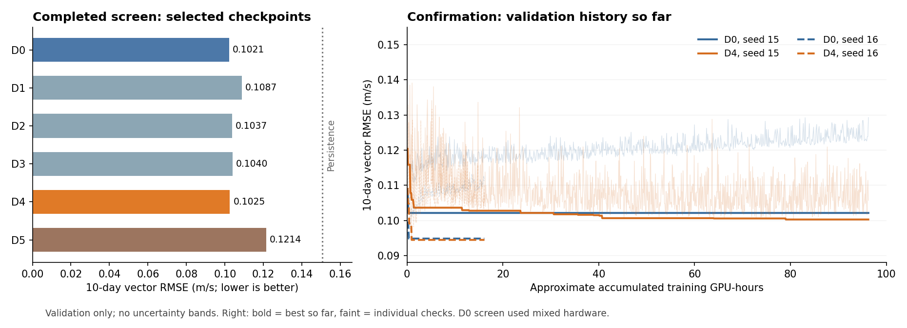

<!--
SPDX-FileCopyrightText: 2026 Samudra Authors

SPDX-License-Identifier: CC-BY-4.0
-->

# Intermediate report: shared Samudra velocity transfer

**Snapshot: September 14, 2026, 08:42 EDT.** Training continues; this is an intermediate report, not the final held-out comparison.

**Main finding:** shared-backbone training across global and regional OM4 inputs is working. The completed screen selected **D4**, the joint model with explicit geometry channels removed. We do **not yet have convincing evidence of improved 10-day observational forecast skill**: D4 was close to the DUACS-only screening reference, and its two provisional confirmation comparisons improve 10-day validation RMSE by only about **1.8% and 0.4%**. Longer-lead validation results are more promising, particularly for seed 15.

## What was run

The original Samudra ConvNeXt U-Net shares all backbone weights. DUACS and OM4 have separate shallow 1×1 input/output adapters; both OM4 resolutions use the same OM4 adapters. Inputs are four historical velocity maps (about 15 days), and forecasts are advanced recursively. DUACS is coarsened to ¼°; OM4 supplies global 1° fields and ¼° regional inputs with 384×384 pixels, including a 128-pixel halo around the 128×128 scored interior. OM4 targets are geostrophic velocities derived from SSH, matching the type of DUACS observable. The model predicts velocities only. The locally integrated Rust loader is used throughout.

Training ends in September 2018. Current selection scores use the same **12 validation dates** from 2019–2020, with area-weighted vector RMSE outside ±5° latitude. Full validation has 101 eligible windows and the untouched forecast test cohort has 118 windows in 2021–2022. Each window contains its complete history and six-step future within the split. Means, scales, masks and climatology use training dates only.

## Completed screening results

All six screens completed. Values below are from the checkpoint selected by **10-day validation RMSE**. Lower RMSE is better; the final column evaluates those same checkpoints at 30 days.

| Arm | Training configuration | 10-day RMSE (m/s) | Difference from D0 (+ worse) | 30-day RMSE (m/s) |
| --- | --- | ---: | ---: | ---: |
| D0 | DUACS only | 0.10212 | +0.00% | 0.19026 |
| D1 | + global 1° OM4 | 0.10874 | +6.48% | 0.19827 |
| D2 | + regional ¼° OM4 | 0.10365 | +1.50% | 0.19206 |
| D3 | + both OM4 tasks | 0.10395 | +1.79% | 0.18167 |
| D4 | D3, explicit geometry removed | 0.10252 | +0.39% | 0.17087 |
| D5 | OM4 pretrain → DUACS fine-tune | 0.12139 | +18.87% | 0.22461 |

Persistence on this cohort: **0.15057 m/s at 10 days**, and **0.22697 m/s at 30 days**. Every selected screening checkpoint beats persistence at 10 days. Monthly climatology and damped linear extrapolation remain to be scored in the full evaluation.

**Comparison limits:** these are selection-cohort scores from one seed, without confidence intervals. D0 screening began on A100 and resumed on RTX6000; all transfer screens used RTX6000. The D0 differences are descriptive, not a matched-hardware compute comparison. The confirmation runs below all use RTX6000.

## Provisional confirmation results

Each D0–D4 pair has the same seed and training target. These are **best validation scores so far**, not final training states or test results. Progress is approximate model-training wall time on four GPUs, toward a roughly 31-hour run.

**Seed and budget clarification:** all screening runs used seed 15 with a 48 GPU-hour target. Confirmation seed 15 restarts from scratch with the same seed and a 128 GPU-hour target (2.67× longer), which also stretches the time-based cosine learning-rate decay. For D4, the saved configurations differ only in that budget and the output directory; architecture, data, task mixture, optimizer settings and initial learning rate are unchanged. Seeds 16 and 17 provide new-seed replications at the longer budget. Confirmation seed 15 is therefore not an independent new-seed replication of the screen.

| Seed | Progress per run | D0 10-day RMSE | D4 10-day RMSE | D4 improvement |
| --- | --- | ---: | ---: | ---: |
| 15 | ~24.1 / 31 h; running | 0.10212 | 0.10026 | +1.82% |
| 16 | ~4.0 / 31 h; running | 0.09483 | 0.09445 | +0.40% |
| 17 | Queued | — | — | — |

At those same selected checkpoints, the 30-day D0→D4 changes are **0.18997→0.16709 m/s for seed 15** (12.0% lower) and **0.16795→0.16691 m/s for seed 16** (0.6% lower). Seed 15 also has a short-lead tradeoff: D4 is about 3.8% worse at five days. Seed 16 is much less mature, so differences between seeds are provisional.

## Analysis so far

1. **Training feasibility is demonstrated; transfer benefit is not established.** One convolutional backbone trained successfully across these grids and extents. That does not establish generalization to unseen extents, LLC resolution, or SSH forecasting. The provisional 10-day gains are below the planned 3% improvement target, and no held-out comparison has been run.

2. **The more interesting signal is at longer leads.** D4 has better 20–30-day screening RMSE and a sizeable 30-day improvement in confirmation seed 15. This could reflect useful transfer, but RMSE alone cannot distinguish improved evolution from stronger damping toward the mean. The weaker seed-16 difference makes a broad claim premature.

3. **More training is not monotonically improving validation.** D0’s best confirmation checkpoints appeared within approximately 4–6 minutes of training; its later validation errors are higher. D4 seed 15 found its current best near 20 hours. This is consistent with overfitting or worsening recursive forecasts after early fitting. Training loss is not a sufficient selection criterion; retained validation checkpoints matter. Repeated selection among hundreds of checks also makes these validation minima optimistic.

4. **Geometry and transfer are confounded in the selected comparison.** D4 improves on D3’s 10-day screening RMSE by about 1.4%, but only in one screening seed. D4 removes explicit position and spacing, while retaining mean-flow maps, masks, shape differences and global/crop boundary behavior. D0→D4 changes both task mix and geometry inputs. A DUACS-only control without geometry is needed to isolate the multitask contribution.

5. **Sequential pretraining was weak in this configuration.** D5’s best screening 10-day RMSE was worse than simultaneous transfer and D0. Its best checkpoint appeared just after switching to DUACS fine-tuning, and subsequent validation deteriorated. This result is specific to the chosen 40% pretraining schedule and optimizer settings; it does not rule out other pretraining strategies.

## Ongoing and planned work

- **Running:** D0 and D4 for seeds 15 and 16, four four-GPU RTX6000 jobs. Seed 17 is queued at the scheduler’s group GPU limit. The remaining seeds were released from sequential dependencies to use available capacity without adding runs or changing training sizes.
- **Next:** finish all six confirmation runs, then evaluate every eligible validation and test date at 5/10/20/30 days. Compare persistence, training-only monthly climatology and fixed-damping linear extrapolation on identical cells and dates.
- **Final analysis:** global and regional errors (Gulf Stream, Kuroshio, Southern Ocean, North Pacific gyre), biases, seed variation and paired seed/calendar-quarter bootstrap intervals. Inspect longer-lead regressions as well as the primary 10-day metric; compare learning curves at matched DUACS exposure as a diagnostic.
- **Follow-up experiments, not yet launched:** a DUACS-only/no-geometry control; spacing-only or explicit global/crop conditioning; separate normalization statistics or OM4 adapters if task interference is implicated. Larger halos, held-out crop sizes and the unused ½° data can test whether gains generalize beyond the trained extents. Forecast-variance/spectral diagnostics would help interpret any long-lead RMSE gain.

**ETA:** aiming for **Wednesday, September 16** for the completed evaluation and brief final report, provided seed 17 starts when the first pair releases capacity. Thursday remains a useful buffer for scheduling and preemption. No training changes are being made in response to test results.

## Limits and artifacts

The DUACS fields are retrospective reprocessed five-day means, not operational issuance-vintage forecasts. OM4 resolutions come from the same underlying simulation; they are not independent model trajectories. Only velocities are predicted, the equatorial band is excluded, and no LLC data are used. A successful velocity result would not establish SSH skill. Three seeds and fewer than two test years will limit the strength of eventual uncertainty claims.

Artifacts: [run summary](run-summary.csv), [snapshot and provenance](snapshot.json), [validation history CSV (gzip)](validation-history.csv.gz), and [vector figure](validation-progress.svg). Raw checkpoints and full logs remain under `/scratch/jr7309/runs/velocity-transfer/`. The plotted training times and exposures come from the nearest preceding training log entry; they are approximate and exclude queue time.

[Live W&B project](https://wandb.ai/ocean_emulators/samudra-velocity-transfer) · [experiment plan and execution notes](../shared-samudra-extents.md) · [prepared-data audit](../velocity-transfer-artifacts/data-audit.json). Training/evaluation source is pinned to commit `c4f36fa6194f9af9334d7f9924aace7c2c9c33f2`; the runtime includes the locally merged Rust loader at `9cd36b1bdcf4921fb027494afa4157e217818ccd`.
