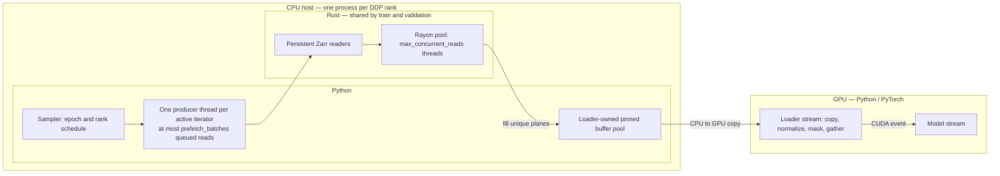

<!--
SPDX-FileCopyrightText: 2026 Samudra Authors

SPDX-License-Identifier: Apache-2.0
-->

# Samudra Rust data loading

The optional `samudra-rust-loader` extension accelerates local OM4 training and
validation without changing Samudra's sampling or batch semantics. Python still
decides which examples belong in each batch and deduplicates physical planes across
the autoregressive rollout. Rust keeps the Zarr arrays open and reads each unique
plane concurrently. The Rust-only fast path transfers and preprocesses those unique
planes before gathering the model-facing tensors.

Select it with:

```yaml
data:
  loading:
    type: rust
    prefetch_batches: 2
    max_concurrent_reads: 8
    prefetch_to_device: true
```

## Pipeline and ownership

Python owns scheduling, normalization, masking, and CUDA operations. Rust owns
local Zarr reads and decompression; it has no dependency on Torch or CUDA.



There are three independent concurrency layers:

1. **Native reads within a batch.** Each process owns one Rayon pool, sized by
   `max_concurrent_reads` and shared by its training and validation readers. A
   flat OM4 batch is planned as unique `(time index, variable)` plane reads
   across every sample and autoregressive step; Rayon runs up to the configured
   number concurrently. The PyO3 call releases the GIL during reading and
   decompression. Readers and Zarr array metadata persist across batches.
2. **Bounded host prefetch across batches.** One Python producer thread consumes
   the already-computed sampler schedule and keeps at most `prefetch_batches`
   futures queued. The single producer prevents multiple batches from each
   trying to occupy the full native pool. Results are yielded in sampler order,
   so shuffle, epoch seeding, and rank-local DDP partitioning are unchanged.
3. **CUDA transfer and preparation overlap.** With pinned memory and
   `prefetch_to_device`, each unique plane is copied once and normalized and
   masked on a dedicated CUDA stream. Only then does a device-side indexed
   gather materialize repeated input/label/rollout positions. The model stream
   waits on one event when that batch is yielded, while the following host read
   can proceed in parallel with model work.

Every DDP rank has its own host producers and CUDA prefetch streams, one each
for its training and validation loaders. Those loaders have separate
pinned-buffer pools but share the rank's bounded native read pool. There are no
PyTorch `DataLoader` worker processes on the Rust path.

## Buffer lifetime and memory bounds

### Where pinning happens

Pinning happens before the Zarr read. `prefetch_batches` bounds the host read
queue; `prefetch_to_device: true` separately enables one-batch-ahead transfer and
preparation on a CUDA stream when training on CUDA. Device prefetch forces pinning
on even if `pin_mem` is false. With device prefetch disabled, `pin_mem` controls
whether the loader uses pinned buffers, and preparation runs on the consumer stream. The host producer requests one float32 tensor per unique read group,
normally prognostic and boundary planes. Input and label share the prognostic
group when they use the same physical store.

On the first request for a shape, the pool calls:

```python
torch.empty(shape, dtype=torch.float32, pin_memory=True)
```

This allocates page-locked host memory through PyTorch's CUDA host allocator.
The tensor has shape `(unique_time, channel, y, x)` and is exposed to PyO3 as a
NumPy view. NumPy and Torch share the same CPU allocation; no data is copied to
create the view. Rust reads and decompresses the selected Zarr chunks, then
writes each plane directly into that pinned destination. Logical rollout maps
remain small CPU index tensors. There is no intermediate pageable batch and no
Python collation copy. The native decoder still has bounded per-read scratch
before copying a decoded plane into its pinned location.

When the CUDA-prefetch iterator consumes the batch, `Tensor.to(device,
non_blocking=True)` queues one host-to-device copy per unique read group.
Normalization and masking run on the unique device planes. `index_select` then
duplicates processed planes into the existing `ModelBatch` input, boundary, and
label layout. Thus overlapping rollout values are copied from CPU to GPU once and are copied
device-to-device only after preprocessing. The host producer can concurrently
fill another set of pinned buffers while the model stream works.

### When a pinned buffer can be reused

After device preparation is queued, the loader records a CUDA event on the
prefetch stream and releases the raw host tensors to the pool with that event.
The event follows the copies and preparation. This could be tightened: host
buffers only need to wait for the copies to finish.

Released tensors first enter a pending-event queue. On each later acquisition,
the pool queries pending events without blocking:

- completed event: move the tensor to the free list;
- incomplete event: leave the tensor pending and allocate/reuse another buffer;
- free tensor with sufficient capacity: return it for the next read.

The pool reuses any allocation with sufficient capacity and retains only the three
largest free buffers, enough for one input/boundary/label group set. On a CPU path
there is no asynchronous H2D consumer, so pooled tensors return to the free list
immediately after batch preparation.

Iterator exhaustion, early close, and producer or preparation errors close the
prefetch producer and reclaim completed buffers. Already queued CUDA transfers
retain their event-protected buffer leases even when preparation fails.
A load failure returns every tensor acquired for the partial batch immediately
because no device transfer was queued.

Memory is bounded by the prefetch depth, the batch being prepared, and native
read scratch. Flat reads hold one decompressed plane per active Rayon task.
Compact reads group requested levels by physical array and retain at most one
physical array's scratch per concurrent time index.

## Format translation

- **Flat OM4:** canonical depth channels such as `thetao_4` are physical array
  names and are passed directly to Rust.
- **Compact OM4:** Python maps `thetao_4` to the explicit selector
  `("thetao", 4)`. Rust groups requested levels backed by the same physical array.
- **Encoded values:** direct reads do not apply Xarray's CF decoding. Selected
  physical arrays with `scale_factor`, `add_offset`, or non-NaN `_FillValue` /
  `missing_value` sentinels are rejected before a native reader is opened. Use
  `loading.type: cpu` for these stores. NaN fill values remain supported.
- **Derived channels:** seasonal-climatology fields such as `hfds_anomalies` are
  unsupported. The current check runs after Python canonicalization; configurations
  that compute these fields can therefore do expensive work before failing.

The current loader is local-filesystem only and supports training and validation.
S3, LLC, and inference remain follow-on work. Python retains the existing
homogeneous-`dataset_id` batch contract.

## Installation and tests

In a source checkout, install the optional extension with `uv sync --extra rust`.
The default installation does not require Rust. The root
[`rust-toolchain.toml`](../rust-toolchain.toml) pins the compiler used for builds;
the crate uses Rust edition 2024. There is no separately advertised minimum
supported Rust version.

The native crate lives in [`rust/loader`](../rust/loader). Its small standalone
test environment does not install Torch or Samudra:

```bash
uv sync --project rust/loader --python 3.12 --locked --group test
uv run --project rust/loader --locked --group test pytest -c rust/loader/pyproject.toml rust/loader/tests
# Embedded Python needs the test environment's NumPy on its import path.
export PYTHONPATH="$(uv run --project rust/loader --locked python -c 'import site; print(site.getsitepackages()[0])')"
PYO3_PYTHON="$PWD/rust/loader/.venv/bin/python" cargo test --manifest-path rust/loader/Cargo.toml --lib
cargo fmt --manifest-path rust/loader/Cargo.toml -- --check
cargo clippy --manifest-path rust/loader/Cargo.toml --all-targets -- -D warnings
```

Native Rust tests link Python and run without the `extension-module` feature.
Wheel builds enable that feature for the Python shared library (`cdylib`).
The Rust CI workflow separately runs the Samudra integration suite with the Rust
extra installed. GPU CI covers pinned buffers and CUDA prefetch. Regular CPU CI
runs without the Rust extra.

The integration tests compare native and Python `ModelBatch` values for flat and
compact stores, history windows, rollout steps, strides, masks, normalization,
and different input/label grids. They also cover deterministic schedules and
cleanup after iterator exhaustion, early exit, and read errors.

## Native code and CPU targets

The repository's [Cargo configuration](../.cargo/config.toml) sets a modern Linux
server baseline: `x86-64-v3` on x86_64, and Neoverse V1 on aarch64. Rust flags tune
the extension and Rust dependencies; target-specific `CFLAGS` tune bundled native
codecs. Wheels built with these settings require compatible CPUs.

`zarrs` builds the bundled C-Blosc sources through `blosc-src`; it does not link a
system `libblosc.so`. Read concurrency is bounded by the shared Rayon pool.

## Recorded performance

Environment: Torch `gr101`, 2x RTX6000, full v2 high-resolution Samudra model
with 84,002,154 parameters, `/scratch/jr7309/data/om4_quarterdeg_v2`, one year
of training samples, batch size 1, gradient accumulation 4, rollout steps `[4]`,
and boundary variables `tauuo,tauvo,hfds`. Both runs used the same container
image, `ghcr.io/m2lines/ocean-emulator-physicsnemo:26.05-ca4d907eb936d37641511f5adb40c3270dd5e6ee`,
with `NCCL_P2P_DISABLE=1`.

The attempted two-epoch CPU/Rust matched job (`14115987`) was stopped after CPU
epoch 1 and part of CPU epoch 2 because CPU validation and epoch-2 first-batch
loads would not leave enough time for the Rust half in the one-hour allocation.
The table therefore compares the completed CPU epoch 1 from that job with a
completed Rust one-epoch run (`14117615`) submitted immediately afterward on the
same node.

| Loader | Job / run | Train epoch total | Mean iter excluding step 0 | Mean iter excluding step 0 and data waits >=1s | Median data wait excluding step 0 | Validation total | Peak CPU / GPU memory |
| --- | --- | ---: | ---: | ---: | ---: | ---: | ---: |
| CPU | `14115987` / `qdeg-2gpu-ca4d907e-cpu-20260717-154900` | 22.31 s/it | 14.59 s | 4.12 s | 0.003 s | 81.61 s/it | 41.7 GB / 49.1 GB |
| Rust | `14117615` / `qdeg-2gpu-ca4d907e-rust-only-20260717-163700` | 4.13 s/it | 3.24 s | 3.21 s | 0.002 s | 0.59 s/it | 16.3 GB / 53.9 GB |

This is a 5.4x train-epoch improvement and a 139x validation improvement for
this specific one-epoch quarter-degree run. The narrower non-stall training
number is only 1.3x faster, which matches the profile evidence: the Rust win is
mostly eliminating CPU-loader cold loads and periodic stalls while keeping steady
GPU compute roughly the same.
