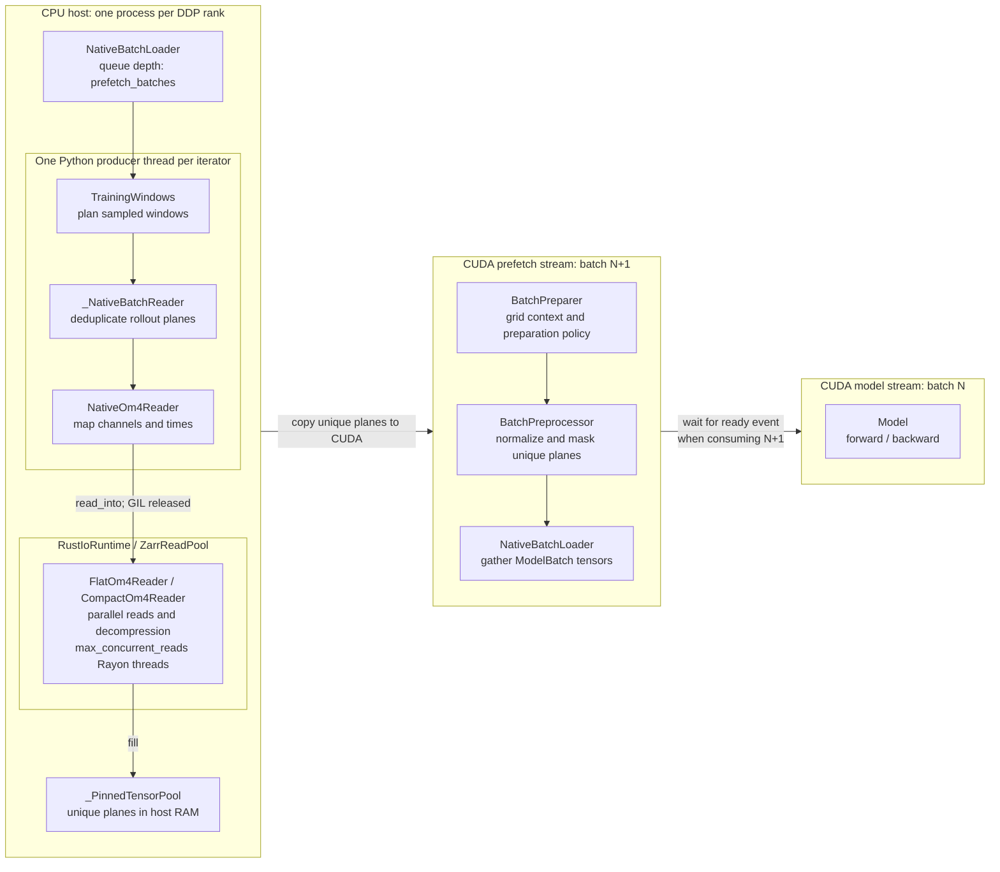

<!--
SPDX-FileCopyrightText: 2026 Samudra Authors

SPDX-License-Identifier: Apache-2.0
-->

# Samudra Rust data loading

The optional `samudra-rust-loader` extension loads local flat and compact OM4
stores for training and validation. Python plans batches and deduplicates physical
planes across each autoregressive rollout. Rust reads those planes concurrently
into host buffers, then Python transfers and prepares them for the model.

Select it with:

```yaml
data:
  loading:
    type: rust
    prefetch_batches: 2
    max_concurrent_reads: 8
    prefetch_to_device: true
```

## Components

`RustDataLoadingConfig` constructs the source readers and `NativeBatchLoader`.
Each data bundle creates one `RustIoRuntime`, shared by its training and validation
readers within the process.

| Component | Responsibility in the Rust loader |
| --- | --- |
| `RustDataLoadingConfig` | Configure read concurrency and prefetch; construct the runtime and loader. |
| `TrainingWindows` | Define input history, forecast targets, stride, masks, and source pairing; produce read plans for the sampled windows. |
| `NativeBatchLoader` (`native_loader.py`) | Follow the sampler schedule, deduplicate batch reads, prefetch, transfer, and gather model tensors. |
| `NativeOm4Reader` (`native_reader.py`) | Map canonical channels and sliced time indices to physical OM4 arrays and depth selections. |
| `RustIoRuntime` (`rust_reader.py`) | Open the extension's flat or compact readers and supply their shared `ZarrReadPool`. |
| `_PinnedTensorPool` | Reuse host buffers after their CUDA consumer events complete. Each loader owns its pool. |
| `BatchPreparer` | Supply model-batch grid context and apply the input, boundary, and label preparation policies. |
| `BatchPreprocessor` | Normalize and mask unique planes using cached device statistics and masks. |

## Pipeline and concurrency

This diagram shows CUDA training with `prefetch_to_device: true` for one DDP
rank. The host, CUDA preparation, and model lanes can work on different batches
concurrently. The CUDA boxes name the Python components that queue work on each
stream.


```mermaid
flowchart LR
    subgraph HOST["CPU host: one process per DDP rank"]
        direction TB
        L["NativeBatchLoader<br/>queue depth: prefetch_batches"]
        subgraph PRODUCER["One Python producer thread per iterator"]
            W["TrainingWindows<br/>plan sampled windows"]
            D["_NativeBatchReader<br/>deduplicate rollout planes"]
            R["NativeOm4Reader<br/>map channels and times"]
            W --> D --> R
        end
        L --> W
        subgraph IO["RustIoRuntime / ZarrReadPool"]
            READ["FlatOm4Reader / CompactOm4Reader<br/>parallel reads and decompression<br/>max_concurrent_reads Rayon threads"]
        end
        R -->|"read_into; GIL released"| READ
        READ -->|"fill"| P["_PinnedTensorPool<br/>unique planes in host RAM"]
    end

    subgraph PREFETCH["CUDA prefetch stream: batch N+1"]
        direction TB
        B["BatchPreparer<br/>grid context and preparation policy"]
        C["BatchPreprocessor<br/>normalize and mask unique planes"]
        G["NativeBatchLoader<br/>gather ModelBatch tensors"]
        B --> C --> G
    end

    subgraph COMPUTE["CUDA model stream: batch N"]
        M["Model<br/>forward / backward"]
    end

    HOST -->|"copy unique planes to CUDA"| PREFETCH
    PREFETCH -->|"wait for ready event<br/>when consuming N+1"| COMPUTE
```

The producer can read a later batch while the CUDA prefetch stream prepares the
next batch and the model stream computes the current one. `prefetch_batches`
limits the host queue; the producer executes one batch read at a time. Within
that read, the Rayon pool performs up to `max_concurrent_reads` tasks concurrently.
The Python thread waits for `read_into` to finish with the GIL released.

`_CudaPrefetchIterator` queues copies and preparation on a dedicated stream, one
batch ahead of the model. The model stream waits for that batch's ready event
before using its tensors. `NativeBatchLoader` coordinates host reads, device
copies, and the final gather.

Each active training or validation iterator has its own producer thread and CUDA
prefetch stream. Their loaders have separate pinned-buffer pools and share the
rank's `ZarrReadPool`. Results are yielded in sampler order.

## Host buffers and device transfer

The producer allocates one float32 tensor per unique read group, usually one for
prognostic planes and one for boundary planes. Input and label reads share a
group when they reference the same physical store and channels. The tensors have
shape `(unique_time, channel, y, x)`.

`read_into` takes integer positions in the source's current time slice.
`NativeOm4Reader` maps these positions to storage rows using a cached index array.
Input and label sources have matching time axes, so the loader can deduplicate
their positions before reading.

For CUDA training, `_PinnedTensorPool` supplies page-locked host memory. CPU
training uses ordinary unpinned buffers. The loader selects pinning automatically
from the training device. Rust fills a NumPy view of that allocation directly.
`read_into` completes all writes before returning or raising, so the caller can
safely reuse the destination after a failed read.

`NativeBatchLoader` copies each unique plane to CUDA once. `BatchPreparer` and
`BatchPreprocessor` apply normalization and masking, then the loader gathers
repeated history and rollout positions into `ModelBatch` tensors.

`HostPrefetch` selects disk-to-RAM read-ahead for CPU training or CUDA training
with `prefetch_to_device: false`. On CUDA, transfer and preparation happen on the
model's current stream when the batch is consumed, using pinned host buffers.
This mode holds fewer prepared batches on the GPU.

### Buffer reuse and cleanup

After queuing CUDA copies and preparation, the loader records an event and returns
the host buffers to `_PinnedTensorPool` with that event. On each acquisition,
the pool queries pending events:

- completed event: move the buffer to the free list;
- incomplete event: keep the buffer pending and allocate or reuse another;
- free buffer with sufficient capacity: reuse it for the next read.

The pool retains the three largest free buffers. Iterator exhaustion, early close,
and producer or preparation errors close the producer and reclaim completed
buffers. Queued CUDA operations retain their event-protected buffer leases even
when preparation fails. A read failure returns its partial batch's buffers
immediately.

Host memory use depends on the prefetch depth, the batch being prepared, reusable
buffers, and native read scratch. Flat reads hold one decompressed plane per
active Rayon task. Compact reads group requested levels by physical array and
retain at most one physical array's scratch per concurrent time index.

## Store requirements and format translation

- **Flat OM4:** canonical depth channels such as `thetao_4` are physical array
  names passed directly to Rust.
- **Compact OM4:** `NativeOm4Reader` maps `thetao_4` to array `thetao`, level `4`.
  Rust groups requested levels backed by the same physical array.
- **Values:** native reads require unscaled float32 values and NaN missing-value
  sentinels. Arrays with `scale_factor`, `add_offset`, or non-NaN `_FillValue` /
  `missing_value` sentinels are rejected before the native reader opens them.
- **Channels:** the configured channels must map to stored physical variables.
  Derived anomaly channels such as `hfds_anomalies` are rejected before datasets
  are opened or canonicalized.

Each batch belongs to one set of `TrainingWindows`, preserving a single source
pair and preparation policy throughout the batch.

## Installation and tests

In a source checkout, install the optional extension with `uv sync --extra rust`.

The native crate and its standalone test environment live in
[`rust/loader`](../rust/loader):

```bash
uv sync --project rust/loader --python 3.12 --locked --group test
uv run --project rust/loader --locked --group test pytest -c rust/loader/pyproject.toml rust/loader/tests
# Embedded Python needs the test environment's NumPy on its import path.
export PYTHONPATH="$(uv run --project rust/loader --locked python -c 'import site; print(site.getsitepackages()[0])')"
PYO3_PYTHON="$PWD/rust/loader/.venv/bin/python" cargo test --manifest-path rust/loader/Cargo.toml --lib
cargo fmt --manifest-path rust/loader/Cargo.toml -- --check
cargo clippy --manifest-path rust/loader/Cargo.toml --all-targets -- -D warnings
```

Native Rust tests link Python. Wheel builds enable the `extension-module` feature
for the Python shared library (`cdylib`). The Rust CI workflow runs the Samudra
integration suite with the Rust extra installed; GPU CI covers pinned buffers
and CUDA prefetch.

Integration tests compare native and Python `ModelBatch` values for flat and
compact stores, history windows, rollout steps, strides, masks, normalization,
and different input/label grids. They also cover deterministic schedules and
cleanup after exhaustion, early exit, and read or preparation errors.

## Native code and CPU targets

The repository's [Cargo configuration](../.cargo/config.toml) sets a modern Linux
server baseline: `x86-64-v3` on x86_64, and Neoverse V1 on aarch64. Rust flags tune
the extension and Rust dependencies; target-specific `CFLAGS` tune bundled native
codecs. Wheels built with these settings require compatible CPUs.

`zarrs` builds bundled C-Blosc sources through `blosc-src`. Read concurrency is
bounded by the shared Rayon pool.

## Recorded performance

Environment: Torch `gr101`, 2x RTX6000, full v2 high-resolution Samudra model
with 84,002,154 parameters, `/scratch/jr7309/data/om4_quarterdeg_v2`, one year
of training samples, batch size 1, gradient accumulation 4, rollout steps `[4]`,
and boundary variables `tauuo,tauvo,hfds`. Both runs used the same container
image, `ghcr.io/m2lines/ocean-emulator-physicsnemo:26.05-ca4d907eb936d37641511f5adb40c3270dd5e6ee`,
with `NCCL_P2P_DISABLE=1`.

The attempted two-epoch CPU/Rust matched job (`14115987`) was stopped after CPU
epoch 1 and part of CPU epoch 2 because CPU validation and epoch-2 first-batch
loads would not leave enough time for the Rust half in the one-hour allocation.
The table therefore compares the completed CPU epoch 1 from that job with a
completed Rust one-epoch run (`14117615`) submitted immediately afterward on the
same node.

| Loader | Job / run | Train epoch total | Mean iter excluding step 0 | Mean iter excluding step 0 and data waits >=1s | Median data wait excluding step 0 | Validation total | Peak CPU / GPU memory |
| --- | --- | ---: | ---: | ---: | ---: | ---: | ---: |
| CPU | `14115987` / `qdeg-2gpu-ca4d907e-cpu-20260717-154900` | 22.31 s/it | 14.59 s | 4.12 s | 0.003 s | 81.61 s/it | 41.7 GB / 49.1 GB |
| Rust | `14117615` / `qdeg-2gpu-ca4d907e-rust-only-20260717-163700` | 4.13 s/it | 3.24 s | 3.21 s | 0.002 s | 0.59 s/it | 16.3 GB / 53.9 GB |

This is a 5.4x train-epoch improvement and a 139x validation improvement for
this specific one-epoch quarter-degree run. The narrower non-stall training
number is only 1.3x faster, which matches the profile evidence: the Rust win is
mostly eliminating CPU-loader cold loads and periodic stalls while keeping steady
GPU compute roughly the same.
