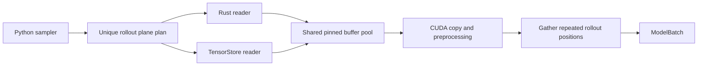

<!--
SPDX-FileCopyrightText: 2026 Samudra Authors

SPDX-License-Identifier: Apache-2.0
-->

# TensorStore in the native batch pipeline

This draft separates the array reader from the local OM4 batch pipeline introduced
by [#800](https://github.com/m2lines/Samudra/pull/800). Selecting TensorStore uses
that same rollout-wide read deduplication, pinned-buffer pool, host prefetch,
CUDA preparation stream, normalization, masking, and device-side gathering.
It does not require the Rust extension.

This differs from [#871](https://github.com/m2lines/Samudra/pull/871), which selects
TensorStore underneath the existing Xarray loader. Here, Xarray still constructs
the semantic source and handles statistics, masks, coordinates, and ordinary reads;
TensorStore serves the optimized training/validation plane reads directly.

## Try it

From this checkout:

```bash
uv sync --extra tensorstore
```

Use physical OM4 boundary variables and select the native TensorStore loader:

```yaml
data:
  loading:
    type: tensorstore
    max_concurrent_reads: 8
    prefetch_batches: 2
    prefetch_to_device: true
  sources:
    - type: om4
      boundary_vars_key: tau_hfds
      # Retain the other location, variable, and time settings from your config.
```

Changing `loading.type` to `rust` uses the original native reader, with the same
batching and prefetch settings. Install `uv sync --extra rust --extra tensorstore`
when comparing both. In a released package, the optional TensorStore dependency
would be installed with `pip install 'samudra[tensorstore]'`.

## Reader interface and buffer ownership

`Om4IoRuntime` opens persistent flat or compact `Om4PlaneReader` objects. Each
reader exposes its physical shape and `read_into(indices, variables, output)`.
The existing native canonical reader maps logical channels and sliced dates onto
these physical reads. Both implementations consume the same plan.



TensorStore opens the Zarr arrays read-only. `tensorstore.array(..., copy=False)`
wraps a NumPy view of a caller-owned Torch allocation; asynchronous writes target
that in-memory view. The reader waits for every submitted operation before
returning. This also applies when submission or completion fails, so another
batch cannot reuse a pinned buffer while an old read is still writing to it.
The existing CUDA events govern reuse after host-to-device transfer.

The runtime shares file I/O and copy thread limits across the rank's readers.
TensorStore's own caching and scheduling differ from Rayon; equal thread settings
are not a claim of identical internal resource use.

For a small reviewable delta over #800, the shared pipeline retains its existing
`rust_data.py` module and `RustTrainDataLoader` name. Choosing TensorStore never
calls `_load_extension()`. A broader naming cleanup is separate from this draft.

## Reproduce the comparison

The benchmark uses the configured data and loader factories. It loads complete
GPU-ready batches without running a model. Run each backend sequentially:

```bash
uv run scripts/benchmark_native_loading.py cpu \
  --data-root ~/data/om4_onedeg --output /tmp/loader-cpu.json
uv run --extra rust scripts/benchmark_native_loading.py rust \
  --data-root ~/data/om4_onedeg --output /tmp/loader-rust.json \
  --reference /tmp/loader-cpu.json
uv run --extra tensorstore scripts/benchmark_native_loading.py tensorstore \
  --data-root ~/data/om4_onedeg --output /tmp/loader-tensorstore.json \
  --reference /tmp/loader-cpu.json
```

The data directory must contain `OM4.zarr`, `OM4_means.zarr`, and `OM4_stds.zarr`.
The script uses physical OM4 channels and the 1958–2021 training interval. Its
sampling window, rollout length, history, device, and concurrency are configurable
with `--help`. The default is batch size 1, 77 prognostic and three boundary
channels, history 1, four rollout steps, four persistent CPU-loader workers, and
eight native read threads with two-batch prefetch.

Each backend first warms the same seeded 16-batch schedule. Every prepared tensor
contributes to a batch digest, normalizing NaN and signed-zero representations.
`--reference` checks all batch digests against the CPU run, outside timed regions.
Three subsequent passes measure average time per GPU-ready batch, including
iterator setup and exhaustion. The JSON reports each pass and their median,
loader construction and first-batch time, and peak PyTorch GPU allocation.

## Local draft benchmark

On September 4, 2026, the committed harness was exercised on a GB10 with the local
uncompressed one-degree OM4 store (180 × 360), Python 3.12, PyTorch 2.9.1+cu130,
and TensorStore 0.1.85. With the defaults above:

| Native reader | Pass averages (ms/batch) | Median (ms/batch) | Peak GPU allocation |
| --- | --- | --- | --- |
| Rust | 23.02, 27.37, 21.19 | 23.02 | 1,031 MiB |
| TensorStore | 26.88, 27.53, 24.11 | 26.88 | 1,031 MiB |

All 16 prepared batches matched the CPU reference for each native reader. These
numbers include the loader's transfer, preprocessing, and gathering, but no model
execution. They show comparable local loader throughput, with Rust faster in
this run; they do not establish statistical equivalence. The harness uses #800's
CPU implementation as its reference, so its CPU timing should not be substituted
for the #871 CPU baseline from the original discussion.

## Scope and remaining experiments

This draft supports local float32 Zarr v2, flat OM4 and compact OM4 with either
`time, lev` or `lev, time` ordering. Encoded scale/offset values and non-NaN fill
sentinels fail explicitly because direct reads bypass Xarray's CF decoding.
The pipeline retains #800's restrictions: no remote stores, LLC, native inference,
or derived seasonal-anomaly channels.

CPU and CUDA parity tests cover compressed fixtures, sliced dates, channel/level
ordering, overlapping rollouts, masks, NaNs, and both preprocessing orders.
Error tests verify that all writes finish before a failed buffer can be released.

A local one-degree loader comparison cannot establish full-training speedups.
The deciding follow-up is a matched compressed quarter-degree, multi-GPU training
experiment measuring epoch time, data-wait stalls, and host/device memory. The
TensorStore reader also needs lifecycle and scheduling review before promotion
from a draft experiment.
