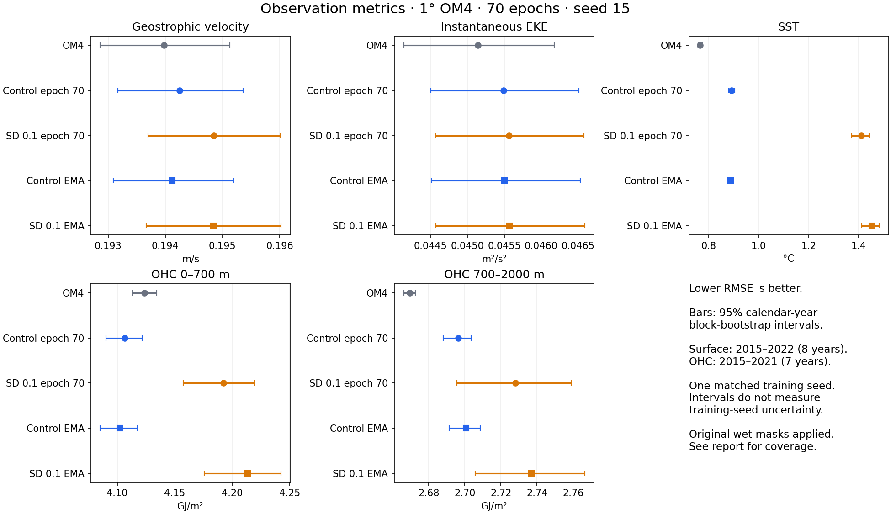

<!--
SPDX-FileCopyrightText: 2026 Samudra Authors
SPDX-License-Identifier: CC-BY-4.0
-->

# Observational metrics: corrected wet-mask backfill

All four saved rollouts have now been scored against DUACS, OISST, and IAP, together with the date-matched OM4 baseline. **For seed 15, constant stochastic depth 0.1 worsens all five primary observational RMSEs at both raw epoch 70 and final EMA.** The largest change is SST: 0.8922 → 1.4109 °C (+58.13%) for raw epoch 70, and 0.8875 → 1.4517 °C (+63.57%) for final EMA. Other primary changes range from +0.14% to +2.70%; these are observed point differences, not claims of significance across training seeds.

This supplements the [OM4 comparison report](../results/RESULTS.md). It is a metrics-only backfill: no retraining or rollout regeneration.

## Figures and spectral comparison

The [complete visualization report](viz/RESULTS.md) adds 20 figures, all 45 regional spectral scores, and time-series diagnostics. SD has mixed spectral effects: better North Pacific/Gulf Stream spatial spectra, but worse global/Gulf Stream temporal KE spectra, with stronger SST cooling drift. These results qualify the comparison without changing the primary RMSE findings below.

## Primary observation RMSE

Lower is better. OHC is displayed in GJ/m² (the CSV stores J/m²).

| Metric | OM4 | Control epoch 70 | SD 0.1 epoch 70 | Control EMA | SD 0.1 EMA |
|---|---:|---:|---:|---:|---:|
| Geostrophic velocity (m/s) | 0.193975 | 0.19425 | 0.194847 | 0.194124 | 0.194837 |
| Instantaneous EKE (m²/s²) | 0.0451419 | 0.0454905 | 0.0455616 | 0.0455033 | 0.0455691 |
| SST (°C) | 0.766418 | 0.892206 | 1.41087 | 0.887527 | 1.45171 |
| OHC 0–700 m (GJ/m²) | 4.12377 | 4.10654 | 4.19229 | 4.10236 | 4.21316 |
| OHC 700–2000 m (GJ/m²) | 2.66948 | 2.6965 | 2.72796 | 2.70077 | 2.73678 |

| Metric | SD 0.1 change, raw epoch 70 | SD 0.1 change, final EMA |
|---|---:|---:|
| Geostrophic velocity | +0.31% | +0.37% |
| Instantaneous EKE | +0.16% | +0.14% |
| SST | +58.13% | +63.57% |
| OHC 0–700 m | +2.09% | +2.70% |
| OHC 700–2000 m | +1.17% | +1.33% |

The point score is the square root of equal-calendar-year mean annual MSE. The 95% intervals use 10,000 calendar-year block-bootstrap draws (fixed seed 0), preserving within-year dependence. They quantify variation across these observed years, not training-seed uncertainty or forecast-ensemble calibration. They are separate score intervals, not paired treatment-effect intervals.

| Metric | OM4 | Control epoch 70 | SD 0.1 epoch 70 | Control EMA | SD 0.1 EMA |
|---|---|---|---|---|---|
| Geostrophic velocity (m/s) | [0.19286, 0.19513] | [0.19317, 0.19536] | [0.1937, 0.19601] | [0.19309, 0.19519] | [0.19366, 0.19603] |
| Instantaneous EKE (m²/s²) | [0.044138, 0.046175] | [0.044503, 0.046509] | [0.044567, 0.046577] | [0.04451, 0.046528] | [0.044571, 0.046591] |
| SST (°C) | [0.7578, 0.77518] | [0.88075, 0.90444] | [1.3711, 1.4406] | [0.87712, 0.89792] | [1.4121, 1.4813] |
| OHC 0–700 m (GJ/m²) | [4.1133, 4.1344] | [4.0903, 4.1214] | [4.1575, 4.2193] | [4.0852, 4.1175] | [4.1756, 4.2424] |
| OHC 700–2000 m (GJ/m²) | [2.6661, 2.6726] | [2.688, 2.7036] | [2.6955, 2.759] | [2.6914, 2.7084] | [2.7058, 2.7665] |

## Residual-variance diagnostics

These measure the amplitude and spatial pattern of variability after removing seasonal cycle and trend. They are separate from primary RMSE. SD 0.1 slightly improves the SST residual-variance diagnostics while worsening upper-700m OHC residual-variance diagnostics, so the result is not uniformly worse on every diagnostic.

| Diagnostic | OM4 | Control epoch 70 | SD 0.1 epoch 70 | Control EMA | SD 0.1 EMA |
|---|---:|---:|---:|---:|---:|
| SST residual-variance map RMSE (°C², lower better) | 0.343183 | 0.447642 | 0.438342 | 0.449335 | 0.440373 |
| SST residual-variance pattern correlation (higher better) | 0.700562 | 0.558785 | 0.569201 | 0.561452 | 0.570834 |
| Upper-700m OHC residual-variance map RMSE ((J/m²)², lower better) | 9.49017e+17 | 5.52953e+17 | 5.97788e+17 | 5.36938e+17 | 5.80257e+17 |
| Upper-700m OHC residual-variance pattern correlation (higher better) | 0.682506 | 0.695283 | 0.640538 | 0.699975 | 0.648511 |

## Mask correction and coverage

The initial scoring pass exposed a writer bug: saved predictions had zero-filled dry cells. The observational scorer treats finite values as water; that admitted land and absent depth levels, distorted coastal gradients, and reported misleading full-column OHC geometry. Those preliminary observational scores are superseded by the corrected table here.

For this backfill, each prognostic channel uses the original `CanonicalSource.masks.prognostic` from the training data, stacked into the prediction layout and applied with `where(mask)` before scoring. The saved `predictions.zarr` stores remain unchanged. The existing OM4 baseline already had missing dry cells and was reused from job 125006. The future writer fix in [PR #917](https://github.com/m2lines/Samudra/pull/917) writes NaNs for dry cells while preserving genuine ocean zeros.

All five scored datasets now have matching periods, sample counts, paired cell counts, and paired-ocean fractions for each primary metric:

| Metric | Actual dates | Samples | Complete years | Paired cells | Paired observation ocean |
|---|---|---:|---:|---:|---:|
| Geostrophic velocity | 2015-01-03–2022-12-24 | 583 | 8 | 2,371,139 | 94.0205% |
| EKE | 2015-01-03–2022-12-24 | 583 | 8 | 2,342,475 | 92.8844% |
| SST | 2015-01-03–2022-12-24 | 583 | 8 | 677,973 | 98.0935% |
| OHC 0–700m | 2015-01-01–2021-12-01 | 84 monthly | 7 | 166,325 | 99.0419% |
| OHC 700–2000m | 2015-01-01–2021-12-01 | 84 monthly | 7 | 145,571 | 98.8470% |

The requested window is 2015–2022. Surface products end December 24, within the scorer's pentad coverage tolerance. OHC monthly averaging drops incomplete December 2022; equal-year scoring then excludes 2022. Residual-variance diagnostics use full common coverage: SST 2014-10-20–2022-12-24 (598 samples), upper-700m OHC 2014-11-01–2022-11-01 (97 monthly samples).

DUACS uses absolute geostrophic velocity derived from model SSH, not model u/v, with the equatorial band excluded. EKE is instantaneous kinetic energy of velocity anomalies about their time means. IAP is a gridded temperature product, not individual Argo profiles. OHC integrates temperature relative to 0 °C; the CSV retains bathymetry-disagreement and partial-column diagnostics. Matching model/OM4 masks does not remove their shared geometric mismatch with IAP.

## Execution, inputs, and saved outputs

- Corrected model scoring: **Grace job 125026**, `COMPLETED 0:0`, elapsed **28:15**, 32 CPUs, 384 GiB request, no GPU. OM4 baseline: **125006**, `COMPLETED 0:0`, elapsed **41:18** for its original five-dataset pass. Job 125004 failed before scoring because the GPU container hook expected a driver; `NVIDIA_VISIBLE_DEVICES=void` resolved CPU startup.
- Training/source revision: `a20c44484`. Observation kernels and default observation configuration come from that preserved source; [score.py](score.py) applies the mask correction. [score.sbatch](score.sbatch) records the CPU-only pinned-container launch. Baseline rows are reused from the first pass rather than recomputed.
- Public observations: `s3://m2lines-pubs/Samudra/v2026-07/obs/{duacs,oisst,argo-iap}.zarr`, endpoint `https://nyu1.osn.mghpcc.org`, anonymous reads. DUACS/OISST cover 598 prepared samples, 2014-10-20–2022-12-24; IAP has 516 monthly samples, 1980-01–2022-12. Scoring uses only the matched windows above.
- OM4 and masks: `/projects/ny/lz1955/multiscale/jrusak/data/om4/v2026-09/om4_onedeg`. Consolidated data metadata SHA256 `b28030e33e0da05dcacc1c91eb5527b53c9f3601a35e00001852983524485d8e` matches the original training location.
- Runtime root: `/projects/ny/lz1955/multiscale/jrusak/runs/current-stochastic-depth-1deg-20261006`. The combined table is `observations/observation_metrics.csv`; each original `evals/{epoch_0070,ema_latest}/` now also contains its own `observation_metrics.csv` with that model plus OM4 (102 rows).
- [Complete CSV](observation_metrics.csv): **255 rows**, 51 per dataset; primary, annual, variance, coverage, and geometry diagnostics. All 255 metric values are finite. Remote/local SHA256 verified: `37e4beb14e013cd96b4593cd256d07e4740f6329066e69f64b97534cab7be31a`.

This backfill writes CSVs and the PR report; it does not retrofit observation metrics into the completed training W&B runs. PR #917 makes future end-of-training evaluations execute observation scoring, retain scalars in `evals/summary.json`, and use W&B when enabled in the evaluation config. Its current-Samudra preset defaults to the final saved checkpoint plus EMA; explicit opt-outs remain available.
