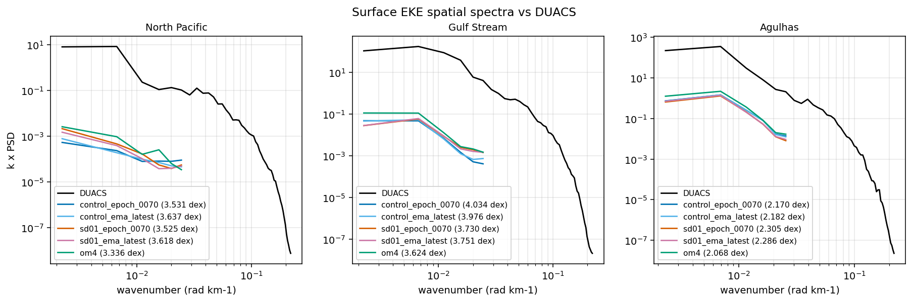
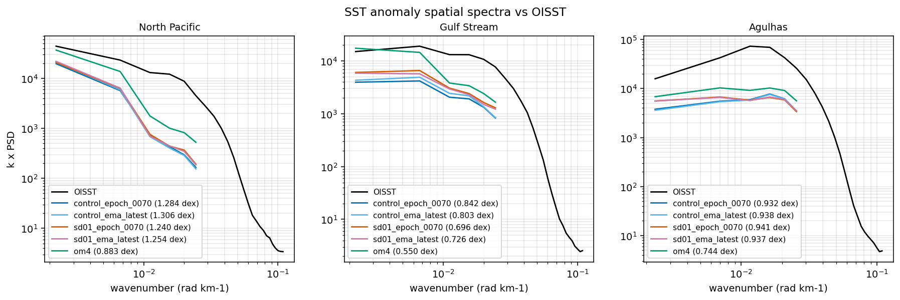
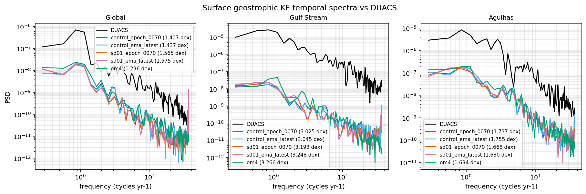
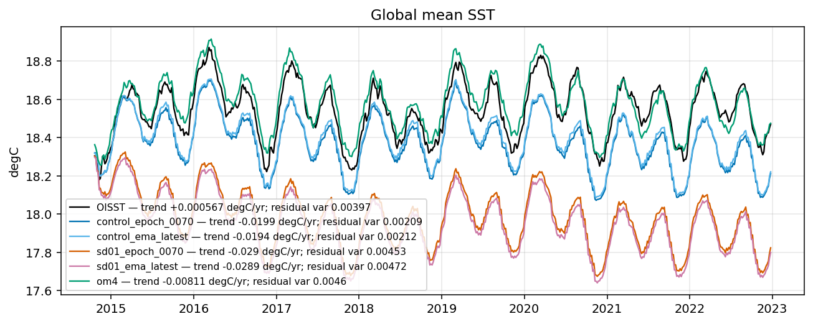
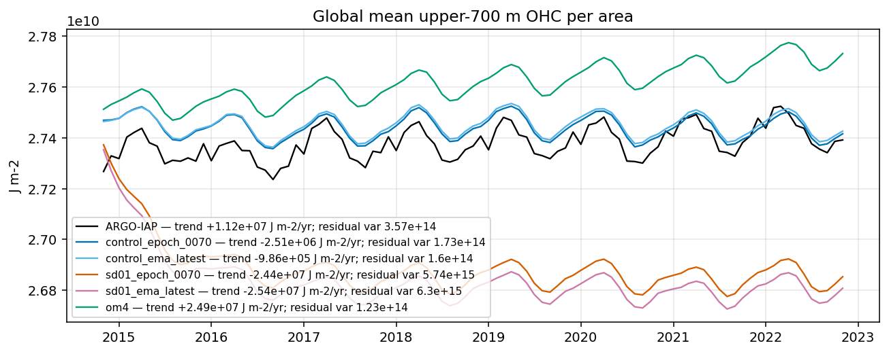
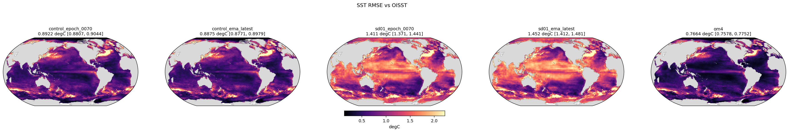

<!--
SPDX-FileCopyrightText: 2026 Samudra Authors
SPDX-License-Identifier: CC-BY-4.0
-->

# Observation figures and spectral comparison

For this seed-15 pair, **SD 0.1 has mixed spectral effects and stronger cooling drift**. It improves EKE and SSTA spatial-spectrum scores in the North Pacific and Gulf Stream, but worsens global and Gulf Stream temporal KE spectra. The earlier result that all five primary observational RMSEs worsen remains unchanged. These are single-seed point comparisons, not treatment-effect confidence intervals.

## Spectral errors

Lower is better; values are RMS log10 power differences in dex over the common positive spectral domain. They are not percentage errors. Curves are compared at observation bins within the model's covered domain, without extrapolating the coarse model into unresolved scales.

| Spectrum / region | OM4 | Control 70 | SD 70 | Control EMA | SD EMA |
|---|---:|---:|---:|---:|---:|
| EKE spatial / North Pacific | 3.336 | 3.531 | 3.525 | 3.637 | 3.618 |
| EKE spatial / Gulf Stream | 3.624 | 4.034 | 3.730 | 3.976 | 3.751 |
| EKE spatial / Agulhas | 2.068 | 2.170 | 2.305 | 2.182 | 2.286 |
| SSTA spatial / North Pacific | 0.883 | 1.284 | 1.240 | 1.306 | 1.254 |
| SSTA spatial / Gulf Stream | 0.550 | 0.842 | 0.696 | 0.803 | 0.726 |
| SSTA spatial / Agulhas | 0.744 | 0.932 | 0.941 | 0.938 | 0.937 |
| KE temporal / Global | 1.296 | 1.407 | 1.565 | 1.437 | 1.575 |
| KE temporal / Gulf Stream | 3.266 | 3.025 | 3.193 | 3.045 | 3.248 |
| KE temporal / Agulhas | 1.694 | 1.737 | 1.668 | 1.755 | 1.680 |

SD improves 5 of 9 regional spectral scores for raw epoch 70 and 6 of 9 for EMA. This count is descriptive, not a validated aggregate metric: the diagnostics are correlated, and some changes are tiny. In both checkpoint comparisons:

- EKE spatial error improves in the North Pacific (slightly) and Gulf Stream, and worsens in Agulhas.
- SSTA spatial error improves in the North Pacific and Gulf Stream. Agulhas is effectively unchanged, with opposite directions for raw and EMA.
- Temporal KE error worsens globally and in the Gulf Stream, and improves in Agulhas.

Both models and 1° OM4 have far less EKE spatial power than DUACS. The large observational gap also exists in the training baseline; the SD change is much smaller than that gap. Native grids and the limited number of coarse-grid spectral bins constrain interpretation. These figures do not establish resolved mesoscale fidelity.

Interannual figures use eight complete years, 2015–2022. Their shaded bands are one log standard deviation across years, not confidence intervals for SD's effect or uncertainty across training seeds.

## Drift and residual variability

The global SST trend is −0.0199 → −0.0290 °C/year for raw checkpoints and −0.0194 → −0.0289 °C/year for EMA; OISST is +0.00057 °C/year over this common record. SD also has a much larger cold offset. These global trends are diagnostics over the rollout window, not estimates of the real-world forced climate response.

SD's global SST residual variance is closer to OISST: 0.00453/0.00472 °C² (raw/EMA), versus control 0.00209/0.00212 and OISST 0.00397. Better residual amplitude coexists with worse absolute SST error and drift.

Upper-700 m OHC shows a strong initial heat-content adjustment in SD followed by a persistent lower level. Its fitted trend is −24.4/−25.4 MJ/m²/year, versus control −2.51/−0.99 and IAP +11.2. SD residual variance is 16.1/17.6 times IAP's, versus control 0.48/0.45 times IAP's. The initial nonlinear adjustment contributes to this residual; larger variance here is not evidence of improved ocean variability. This is area-weighted mean OHC per area, not integrated global heat content.

## All figures and numerical exports

### Spectra

- [eke spatial spectra vs duacs](eke_spatial_spectra_vs_duacs.png)
- [ssta spatial spectra vs oisst](ssta_spatial_spectra_vs_oisst.png)
- [ke temporal spectra vs duacs](ke_temporal_spectra_vs_duacs.png)
- [eke spatial spectra interannual](eke_spatial_spectra_interannual.png)
- [ssta spatial spectra interannual](ssta_spatial_spectra_interannual.png)
- [ke temporal spectra interannual](ke_temporal_spectra_interannual.png)

### Time series

- [global sst](global_sst.png)
- [global sst residual](global_sst_residual.png)
- [global surface eke](global_surface_eke.png)
- [global surface eke residual](global_surface_eke_residual.png)
- [global ohc upper700](global_ohc_upper700.png)
- [global ohc upper700 residual](global_ohc_upper700_residual.png)

### Maps and annual scores

- [surface geostrophic velocity rmse vs duacs](surface_geostrophic_velocity_rmse_vs_duacs.png)
- [surface eke rmse vs duacs](surface_eke_rmse_vs_duacs.png)
- [sst rmse vs oisst](sst_rmse_vs_oisst.png)
- [ohc per area rmse vs argo iap 0 700m](ohc_per_area_rmse_vs_argo_iap_0_700m.png)
- [ohc per area rmse vs argo iap 700 2000m](ohc_per_area_rmse_vs_argo_iap_700_2000m.png)
- [sst residual variance vs oisst](sst_residual_variance_vs_oisst.png)
- [ohc upper700 residual variance vs argo iap](ohc_upper700_residual_variance_vs_argo_iap.png)
- [annual total rmse vs observations](annual_total_rmse_vs_observations.png)

Numerical exports: [spectral scores](spectral_scores.csv), [pooled spectral curves](spectral_curves.csv), [interannual bands](spectral_interannual.csv), [time series](timeseries.csv), [trend and residual-variance statistics](timeseries_statistics.csv), and [unchanged headline metrics](observation_metrics.csv).

## Execution and verification

Grace job **126740** completed with exit 0 on 2026-10-08: **2h25m wall time**, 32 allocated CPUs, 8 Dask threads, 384 GiB requested RAM, no GPU, and about **116.6 GiB peak resident memory** reported for the job step. Figure computation took 8551.5 seconds; the remainder includes container startup. This is the complete five-dataset figure pass, not the earlier headline-scoring timing.

The [driver](../visualize.py) calls the existing observation figure builders directly, reusing the verified masked headline CSV and avoiding unrelated legacy visualization/profile work. It applies original per-channel wet masks lazily to all four prediction stores and selects OM4 at the identical forecast timestamps. No training or rollout regeneration was performed. The palette is expanded to six entries so no model/baseline curve is silently omitted. Spectral and time-series values are captured from the same inputs used by the plotting functions; the mainline scoring API is unchanged.

All 20 PDFs and 20 PNGs were produced. All 47 downloaded files were SHA-256 verified against the remote copies. All 45 finite spectral scores were independently reproduced from the exported curves using the scoring kernel; all spectral bands report eight years. The headline CSV matches the prior corrected report. Selected spectra, interannual bands, SST maps, and SST/OHC time series were visually inspected.

PNG previews and all six CSVs are committed here. Original vector PDFs total roughly 1.25 GB (dense global map meshes), so they remain in project storage at `alpha:/projects/ny/lz1955/multiscale/jrusak/runs/current-stochastic-depth-1deg-20261006/observations/viz/`, with the logs and completion marker. [Job configuration](../viz_job.json) records the pinned image and resources. No metrics were added retroactively to W&B.
