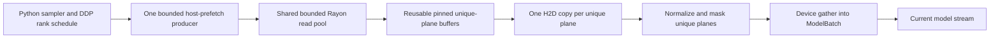

<!--
SPDX-FileCopyrightText: 2026 Samudra Authors

SPDX-License-Identifier: Apache-2.0
-->

# Samudra Rust data loading

The optional `samudra-rust-loader` extension accelerates local OM4 training and
validation without changing Samudra's sampling or batch semantics. Python still
decides which examples belong in each batch and deduplicates physical planes across
the autoregressive rollout. Rust keeps the Zarr arrays open and reads each unique
plane concurrently. The Rust-only fast path transfers and preprocesses those unique
planes before gathering the model-facing tensors.

Select it with:

```yaml
data:
  loading:
    type: rust
    prefetch_batches: 2
    max_concurrent_reads: 8
    prefetch_to_device: true
```

## Pipeline and ownership



There are three independent concurrency layers:

1. **Native reads within a batch.** Each process owns one Rayon pool, sized by
   `max_concurrent_reads` and shared by its training and validation readers. A
   flat OM4 batch is planned as unique `(time index, variable)` plane reads
   across every sample and autoregressive step; Rayon runs up to the configured
   number concurrently. The PyO3 call releases the GIL during reading and
   decompression. Readers and Zarr array metadata persist across batches.
2. **Bounded host prefetch across batches.** One Python producer thread consumes
   the already-computed sampler schedule and keeps at most `prefetch_batches`
   futures queued. The single producer prevents multiple batches from each
   trying to occupy the full native pool. Results are yielded in sampler order,
   so shuffle, epoch seeding, and rank-local DDP partitioning are unchanged.
3. **CUDA transfer and preparation overlap.** With pinned memory and
   `prefetch_to_device`, each unique plane is copied once and normalized and
   masked on a dedicated CUDA stream. Only then does a device-side indexed
   gather materialize repeated input/label/rollout positions. The model stream
   waits on one event when that batch is yielded, while the following host read
   can proceed in parallel with model work.

Every DDP rank has its own host producers and CUDA prefetch streams, one each
for its training and validation loaders. Those loaders have separate
pinned-buffer pools but share the rank's bounded native read pool. There are no
PyTorch `DataLoader` worker processes on the Rust path.

## Buffer lifetime and memory bounds

### Where pinning happens

Pinning happens before the Zarr read, not as a copy after loading. CUDA device
prefetch forces pinning on even if the top-level training `pin_mem` setting is
false. Without CUDA prefetch, `pin_mem` controls whether the Rust loader uses
the pool. The host producer requests one float32 tensor per unique read group,
normally prognostic and boundary planes. Input and label share the prognostic
group when they use the same physical store.

On the first request for a shape, the pool calls:

```python
torch.empty(shape, dtype=torch.float32, pin_memory=True)
```

This allocates page-locked host memory through PyTorch's CUDA host allocator.
The tensor has shape `(unique_time, channel, y, x)` and is exposed to PyO3 as a
NumPy view. NumPy and Torch share the same CPU allocation; no data is copied to
create the view. Rust reads and decompresses the selected Zarr chunks, then
writes each plane directly into that pinned destination. Logical rollout maps
remain small CPU index tensors. There is no intermediate pageable batch and no
Python collation copy. The native decoder still has bounded per-read scratch
before copying a decoded plane into its pinned location.

When the CUDA-prefetch iterator consumes the batch, `Tensor.to(device,
non_blocking=True)` queues one host-to-device copy per unique read group.
Normalization and masking run on the unique device planes. `index_select` then
duplicates processed planes into the existing `ModelBatch` input, boundary, and
label layout. Thus overlapping rollout values cross PCIe once and are copied
device-to-device only after preprocessing. The host producer can concurrently
fill another set of pinned buffers while the model stream works.

### When a pinned buffer can be reused

After device preparation is queued, the loader records a CUDA event on the
prefetch stream and releases the raw host tensors to the pool with that event.
This is conservative: the event follows both the H2D copies and the queued
preparation, although only completion of the copies is required to make the
host memory reusable.

Released tensors first enter a pending-event queue. On each later acquisition,
the pool queries pending events without blocking:

- completed event: move the tensor to a free list keyed by its exact shape;
- incomplete event: leave the tensor pending and allocate/reuse another buffer;
- matching free tensor: return it for the next read.

The pool reuses any allocation with sufficient capacity and retains only the three
largest free buffers, enough for one input/boundary/label group set. On a CPU path
there is no asynchronous H2D consumer, so pooled tensors return to the free list
immediately after batch preparation.

Iterator exhaustion, early close, and producer errors reclaim completed buffers.
A load failure returns every tensor acquired for the partial batch immediately
because no device transfer was queued.

Memory is bounded by the prefetch depth, the batch being prepared, and native
read scratch. Flat reads hold one decompressed plane per active Rayon task.
Compact reads group requested levels by physical array and retain at most one
physical array's scratch per concurrent time index.

## Format translation

- **Flat OM4:** canonical depth channels such as `thetao_4` are physical array
  names and are passed directly to Rust.
- **Compact OM4:** Python maps `thetao_4` to the explicit selector
  `("thetao", 4)`. Rust groups requested levels backed by the same physical array.
- **Derived channels:** seasonal-climatology fields such as `hfds_anomalies` are
  rejected during Rust configuration until native derivation is implemented.

The current loader is local-filesystem only and supports training and validation.
S3, LLC, and inference remain follow-on work. Python retains the existing
homogeneous-`dataset_id` batch contract.

## Native code and CPU targets

The extension and its native codec dependencies are built for an explicit
modern server baseline on Linux:

- x86_64 uses `x86-64-v3` (AVX2, FMA, BMI, and SSE4.2);
- arm64 uses Neoverse V1 (Armv8.4-A and SVE), which matches the Graviton3
  container builder and runs on our newer Grace and GB10 hosts.

These settings live in the repository's [Cargo configuration](../../.cargo/config.toml).
Rust's `target-cpu` controls the extension and Rust dependencies. Target-specific
`CFLAGS` separately control bundled C/C++ dependencies, including Blosc, LZ4,
Zstd, zlib, and Snappy. The repository's
[`rust-toolchain.toml`](../../rust-toolchain.toml) pins the compiler and components
used by local builds, CI, and the training container.

`zarrs` depends on `blosc-src`; Cargo downloads that crate's source package and
then compiles its bundled C-Blosc 1.21.6 sources into a static `libblosc.a`.
It does not download a prebuilt Blosc binary or link a system `libblosc.so`.
On x86_64, enabling the v3 target also causes `blosc-src` to compile the
hand-written AVX2 shuffle and bitshuffle routines; C-Blosc selects AVX2 after a
runtime CPU/OS check. C-Blosc 1.x has no hand-written ARM shuffle implementation,
so the ARM build uses its generic shuffle and bitshuffle implementation. The
Neoverse V1 build does emit SVE in BloscLZ decompression and copy loops, but the
generic bitshuffle loop remains scalar. Even C-Blosc2 currently leaves its NEON
bitshuffle path disabled because upstream found it slower than the generic path;
this is worth benchmarking separately if ARM loading becomes a bottleneck.

## Further work

The remaining rollout stages and deferred work are in
[`docs/rust-data-loader-plan.md`](../../docs/rust-data-loader-plan.md).
